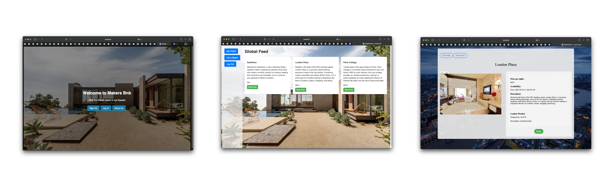

# MakersBnB

[](LICENSE)

Please note that MakersBnB is currently in active development and some features may not be fully implemented or thoroughly tested. While we strive to ensure a stable and reliable experience, there may still be bugs or unexpected behavior.

<p align="center">
 
 
 
 
 
 
 
</p>

## Table of Contents
- [About](#about)
- [Features](#features)
- [Installation](#installation)
- [Usage](#usage)
- [Testing](#testing)
- [Routes](#routes)
- [Contributing](#contributing)
- [License](#license)

## About

MakersBnB is a web application built using Sinatra that provides a platform for users to list and book rental spaces. It is inspired by Airbnb and allows users to create accounts, list available spaces, view space details, and make bookings.

## Screenshots



## Features

- User authentication: Users can sign up for a new account or log in to an existing account.
- Space listing: Users can list their available spaces with details such as name, city, description, price, and availability dates.
- Space search: Users can view a global feed of all listed spaces and search for spaces by city.
- Booking management: Users can book available spaces for specific dates and view their booking details.

## Installation

To run MakersBnB locally, follow these steps:

1. Clone the repository: `git clone https://github.com/Shakhrai8/makers_bnb.git)`
2. Change into the project directory: `cd makers_bnb`
3. Install the dependencies: `bundle install` and `npm install`
4. Set up the necessary environment variables by creating a `.env` file and adding the required values. 
5. Start the application using Rackup: `rackup`
6. Open your browser and visit: `http://localhost:9292`

## Usage

1. Sign up for a new account or log in to an existing account.
2. Create a new space listing by providing details such as name, city, description, price, and availability dates.
3. Explore the global feed to view all available spaces or search for spaces by city.
4. View the details of a specific space, including its description, price, and availability.
5. Make a booking for a space by selecting the desired start and end dates.
6. View your bookings and their details on your profile page.

## Testing

To run the tests for MakersBnB, execute the following command:

```bash
rspec
```

## Routes

- `GET /feed`: Renders the global feed page displaying all available spaces.
- `GET /new_space`: Renders the page to create a new space listing.
- `POST /new_space`: Handles the creation of a new space listing.
- `GET /space/:space_id`: Renders the page displaying the details of a specific space.
- `POST /space/:space_id/photos/add`: Handles the addition of a photo to a space.(In progress)
- `GET /space/:space_id/edit`: Renders the page to edit the details of a specific space.
- `POST /space/:space_id/edit`: Handles the updating of a space's details.
- `GET /space/:space_id/delete`: Renders the confirmation page to delete a space.
- `POST /space/:space_id/delete`: Handles the deletion of a space.
- `GET /space/:space_id/new_booking`: Renders the page to create a new booking for a space.
- `POST /space/:space_id/new_booking`: Handles the creation of a new booking.
- `GET /space/:space_id/new_booking/:booking_id`: Renders the page displaying the details of a specific booking.
- `GET /space/:space_id/new_booking/:booking_id/delete`: Renders the confirmation page to delete a booking.
- `POST /space/:space_id/new_booking/:booking_id/delete`: Handles the deletion of a booking.
- `GET /signup`: Renders the page for user registration.
- `POST /signup`: Handles the user registration process.
- `GET /login`: Renders the page for user login.
- `POST /login`: Handles the user login process.
- `GET /profile`: Renders the profile page.
- `GET /profile/requests`: Renders the requests page.
- `GET /profile/notifications`: Renders the notifications page.
- `GET /logout`: Logs out the current user and redirects to the login page.

## Contributing

Contributions to MakersBnB are welcome! If you have any suggestions, bug reports, or feature requests, please open an issue or submit a pull request.

## License

MakersBnB is licensed under the MIT License. See [LICENSE](LICENSE) for more information.
